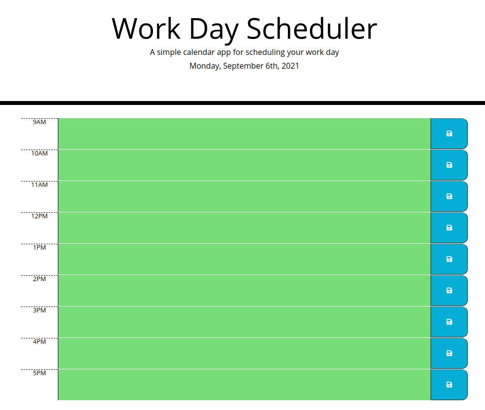

# daily-calendar
1. worked on getting the current date to display in the header.
2. worked on building the structure for displaying the calendar by using bootstrap to layout the cols.
3. used the time block as an id to easily store and pull data from localStorage.
4. created a function to check the current date with the date of the saved data in locaStorage and only display the saved calendarInpus for today.
5. Users can input, edit or delete calendar events

### Link to the deployed application: https://amykep.github.io/daily-calendar/

### screenshot of the Daily Calendar:

